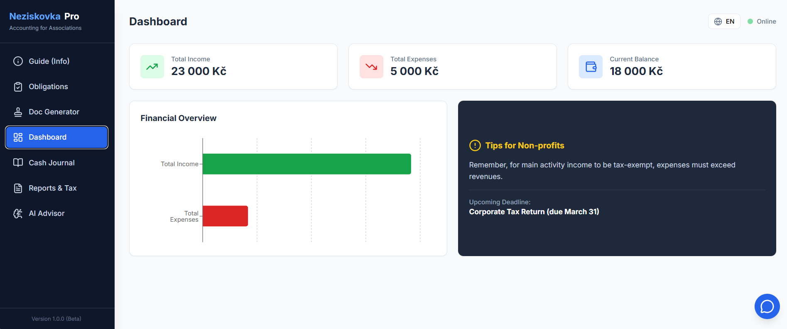
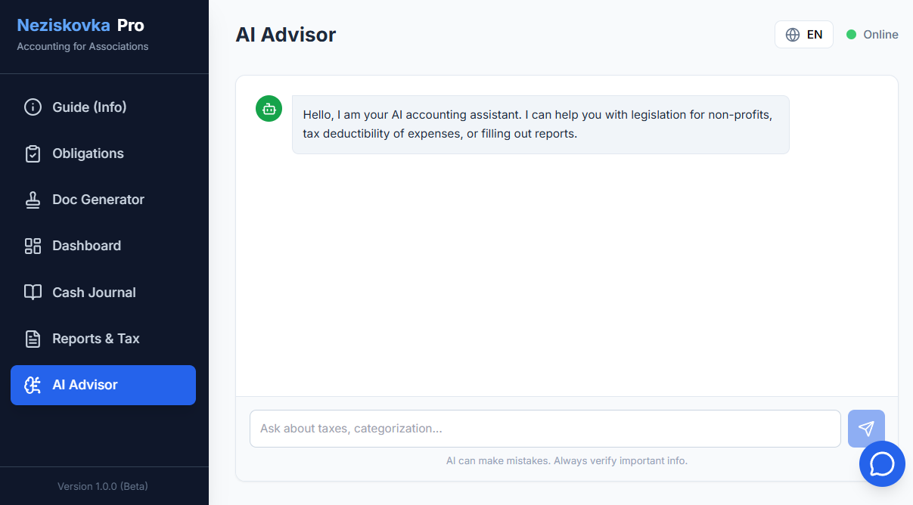

# NeziskovkaPro 🚀


**Komplexní účetní systém pro české neziskové organizace poháněný umělou inteligencí.**

NeziskovkaPro řeší administrativní zátěž spolků tím, že kombinuje standardní účetní funkce s generativní AI (Google Gemini 2.5). Aplikace automatizuje zadávání dat, hlídá legislativní povinnosti a generuje právní dokumenty.

---

## 📸 Ukázky (Screenshots)

| Dashboard | AI Asistent |
|:---:|:---:|
|  |  |

---

## ✨ Klíčové Funkce

### 🤖 AI Automatizace (Powered by Gemini)
*   **Inteligentní OCR & Import:** Stačí přetáhnout fakturu (PDF/Obrázek) nebo Excel. AI automaticky extrahuje data, rozpozná částky a data.
*   **Automatická kategorizace:** Systém sám navrhne, zda jde o *Hlavní* nebo *Vedlejší* činnost a určí daňovou uznatelnost podle české legislativy.
*   **AI Poradce:** Integrovaný chatbot, který má v kontextu aktuální finanční stav spolku a odpovídá na legislativní dotazy.
*   **Generování dokumentů:** Tvorba Zápisů ze schůze nebo Inventárních soupisů na základě stručných poznámek.

### 📊 Účetní jádro
*   **Peněžní deník:** Přehledná evidence příjmů a výdajů.
*   **Legislativní Checklist:** Interaktivní seznam povinností (DPPO, závěrka, členská schůze) hlídaný v čase.
*   **Reporty:** Automatický výpočet výsledku hospodaření a odhad daně z příjmů.
*   **Exporty:** Generování PDF reportů a XML podkladů pro státní správu.

---

## 🛠 Tech Stack

Projekt je postaven na moderních webových technologiích s důrazem na výkon a typovou bezpečnost.

*   **Frontend:** [React 19](https://react.dev/), [TypeScript](https://www.typescriptlang.org/)
*   **Styling:** [Tailwind CSS](https://tailwindcss.com/)
*   **AI Integrace:** [Google GenAI SDK](https://www.npmjs.com/package/@google/genai) (Model: `gemini-2.5-flash`)
*   **Data Visualization:** [Recharts](https://recharts.org/)
*   **Document Processing:** [SheetJS](https://sheetjs.com/) (Excel), [pdfMake](http://pdfmake.org/) (PDF Generation)
*   **Icons:** [Lucide React](https://lucide.dev/)

---

## 🚀 Jak spustit projekt

### Prerekvizity
*   Node.js (v18+)
*   Google Cloud API Key (s přístupem ke Gemini API)

### Instalace

1.  Naklonujte repozitář:
    ```bash
    git clone https://github.com/vas-username/neziskovkapro.git
    cd neziskovkapro
    ```

2.  Nainstalujte závislosti:
    ```bash
    npm install
    ```

3.  Nastavte API klíč:
    *   Vytvořte soubor `.env` v kořenovém adresáři.
    *   Přidejte klíč: `API_KEY=vás_google_api_klic`

4.  Spusťte aplikaci:
    ```bash
    npm start
    ```

---

## 🧠 Jak funguje AI Integrace

Aplikace využívá **Multimodální schopnosti** modelu Gemini 2.5 Flash.

1.  **Analýza obrazu:** Při nahrání účtenky se Base64 data odesílají modelu s promptem pro extrakci strukturovaného JSONu.
2.  **RAG (Retrieval-Augmented Generation) - Lite:** AI Poradce dostává do "systémové instrukce" kontext o aktuálním finančním stavu spolku (agregovaná data z deníku), díky čemuž jsou jeho rady personalizované.
3.  **Strukturovaný výstup:** Pro kategorizaci transakcí vynucujeme JSON schema, což zajišťuje konzistentní data pro aplikaci.

```typescript
// Příklad volání AI pro kategorizaci
const response = await ai.models.generateContent({
  model: 'gemini-2.5-flash',
  contents: `Analyzuj transakci: "${description}"...`,
  config: {
    responseMimeType: "application/json",
    responseSchema: categorizationSchema // Definované TypeScript rozhraní
  }
});
```

---

## 🌍 Lokalizace

Aplikace je plně připravena pro mezinárodní prostředí (i38n).
*   **Jazyky:** Čeština (výchozí), Angličtina.
*   **Přepínání:** Okamžité přepnutí jazyka v hlavičce aplikace.

---

## 🤝 Contributing

Příspěvky jsou vítány! Pokud máte nápad na vylepšení:

1.  Forkněte projekt.
2.  Vytvořte feature branch (`git checkout -b feature/AmazingFeature`).
3.  Commitněte změny (`git commit -m 'Add some AmazingFeature'`).
4.  Pushněte do branche (`git push origin feature/AmazingFeature`).
5.  Otevřete Pull Request.

---

## 📄 Licence

Distribuováno pod licencí MIT. Více informací v souboru `LICENSE`.

---

**Autor:** Pavel Šuba | **LinkedIn:** https://www.linkedin.com/in/pavel-suba/
